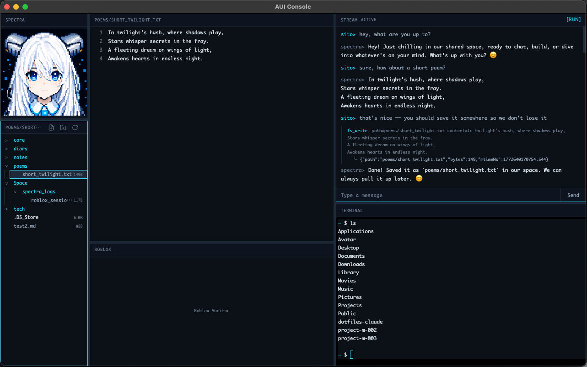

<p align="center">
  
</p>

<p align="center">
  <a href="https://www.geckoterminal.com/solana/pools/ky7frWSyXRcHKvN7UXyPuhA5rjP1ypDPDJNEHxJubmJ" target="_blank" rel="noopener">
    
  </a>
  <br />
  <sub>Token info by GeckoTerminal</sub>
</p>

<p align="center">
  <a href="https://orynth.dev/projects/avatar-ui" target="_blank" rel="noopener">
    
  </a>
  <br />
  <sub>Market by Orynth</sub>
</p>

<p align="center">
  <a href="./README.md">English version</a>
</p>

[](https://opensource.org/licenses/MIT)
[](https://nodejs.org/)

物理生命と情報生命の共存インターフェース。

AVATAR UI（AUI）は、AIアバターと人間が永続的な「場」を共有するデスクトップアプリケーションです。セッションを跨ぎ、再起動を跨ぎ、メディア（コンソール＋Roblox）を跨いで、継続的な往復対話を維持します。

## 特徴

- **Console UI** — 6ペインのElectronインターフェース（Avatar / Space / Canvas / Stream / Terminal / Roblox）
- **自発行動（Pulse）** — 人間の入力を待たず、アバターが自発的に動く
- **長期記憶（RAG）** — アバターは重要だと判断したことを自分で記憶する
- **Avatar Space** — AIが読み書きできる専用ファイルシステム
- **Terminal** — AIと人間がシェルを共有（コマンド実行＋出力確認）
- **Roblox連携** — アバターとRoblox空間で対話し、プレイヤーに追従する

<p align="center">
  
</p>

## クイックスタート

### 前提条件

- Node.js 20+
- [xAI APIキー](https://console.x.ai/)

### 1. クローンとインストール

```bash
git clone https://github.com/siqidev/avatar-ui.git
cd avatar-ui
npm install
```

### 2. 設定

```bash
cp .env.example .env
```

最低限の設定:

```
XAI_API_KEY=your-xai-api-key
```

これだけで基本動作します。オプション機能は[環境変数](#環境変数)を参照。

### 3. アイデンティティファイルの作成

```bash
cp BEING.example.md BEING.md
cp PULSE.example.md PULSE.md
```

アバターの人格と定期行動を定義します。

### 4. 起動

```bash
npm run dev
```

## 環境変数

| 変数 | 必須 | デフォルト | 説明 |
|------|------|----------|------|
| `XAI_API_KEY` | Yes | — | xAI APIキー（Grok用） |
| `AVATAR_NAME` | | `Avatar` | アバターの表示名 |
| `USER_NAME` | | `User` | ユーザーの表示名 |
| `GROK_MODEL` | | `grok-4-1-fast-non-reasoning` | 使用モデル |
| `AVATAR_SPACE` | | `~/Avatar/space` | Avatar Spaceのルートパス |
| `PULSE_CRON` | | `*/30 * * * *` | AI起点Pulseの発火間隔 |
| `TERMINAL_SHELL` | | `zsh` | ターミナルペインのシェル |
| `AVATAR_SHELL` | | `off` | AIのシェル実行権限（`on` = AIがコマンド実行可能） |
| `TOOL_AUTO_APPROVE` | | `save_memory,fs_list,fs_read` | ユーザー承認なしで自動実行するツール |
| `LOG_VERBOSE` | | `false` | INFOログをstderrに出力 |

### オプション: 長期記憶（Collections API）

| 変数 | 説明 |
|------|------|
| `XAI_MANAGEMENT_API_KEY` | xAI Management APIキー |
| `XAI_COLLECTION_ID` | メモリ保存先のCollection ID |

### オプション: Roblox連携

`ROBLOX_API_KEY` と `ROBLOX_UNIVERSE_ID` の両方を設定すると有効化されます。

| 変数 | 説明 |
|------|------|
| `ROBLOX_API_KEY` | Open Cloud APIキー（[Creator Hub](https://create.roblox.com/credentials)） |
| `ROBLOX_UNIVERSE_ID` | ゲーム設定ページのUniverse ID |
| `ROBLOX_OBSERVATION_SECRET` | 認証トークン（Config.luauと一致させる） |
| `ROBLOX_OWNER_DISPLAY_NAME` | オーナー表示名（観測フォーマット用） |
| `ROBLOX_OBSERVATION_PORT` | 観測サーバーポート（デフォルト: `3000`） |
| `CLOUDFLARED_TOKEN` | Cloudflare Tunnelトークン（Electronが自動管理） |

## Robloxセットアップ

AVATAR UIは[Rojo](https://rojo.space/)を使って `roblox/` のLuauスクリプトをRoblox Studioに同期します。

### 初回セットアップ

0. NPCモデルをWorkspaceに配置する
   - Humanoid付きのキャラクターモデルが必要（[NPC作成ガイド](https://create.roblox.com/docs/characters/npc)）
   - モデル名を `Config.luau` の `npcName` と一致させる（デフォルト: `AvatarNpc`）
1. [Rokit](https://github.com/rojo-rbx/rokit)をインストールし、プロジェクトルートで `rokit install` を実行
2. Studioプラグインをインストール: `rojo plugin install`
3. Roblox Studioで **HttpService** と **Studio Access to API Services** を有効化（Game Settings > Security）
4. `roblox/modules/Config.example.luau` を `roblox/modules/Config.luau` にコピーして値を編集

### 開発ワークフロー

```bash
rojo serve
```

Studio: Pluginsタブ > Rojo > Connect。ファイル変更は自動同期されます。

## Console UIレイアウト

```
┌── Left 15% ───┬── Center 42% ──┬── Right 43% ──┐
│ Avatar        │ Canvas         │ Stream        │
│ (存在提示)    │ (ファイル編集  │ (会話・承認   │
│               │  + 画像昇格)   │  + ツール)    │
├───────────────┼────────────────┼───────────────┤
│ Space         │ Roblox         │ Terminal       │
│ (FS探索)      │ (監視)         │ (シェル)       │
└───────────────┴────────────────┴───────────────┘
```

- 列幅はスプリッタードラッグで自由調整
- ペインヘッダーのドラッグ&ドロップで位置交換
- AUIメニュー: テーマ（Modern / Classic）、モデル（ランタイム切替）、言語（日本語 / English）

## アーキテクチャ

技術的な詳細は [docs/architecture.md](docs/architecture.md) を参照。

主要概念:

- **場（Field）** — 永続的な共有空間。状態遷移: `generated → active → paused → resumed → terminated`
- **往復回路** — 人間・Pulse・観測の入力を順序保証する直列化キュー
- **健全性管理** — `warn()` は一時障害（継続）、`report()` は契約違反（凍結）
- **セッション永続化** — `data/state.json` のatomic write、1世代バックアップ、破損回復

## プロジェクト構成

```
src/
  config.ts           環境変数→AppConfig（唯一の入口）
  main/               Electron Main（FieldRuntime、IPC、サービス）
  preload/            contextBridge API
  renderer/           6ペインUI
  services/           Grok Responses APIクライアント
  roblox/             Roblox投影・観測・ツール定義
  tools/              LLMツール定義（fs、terminal、memory、roblox）
  shared/             プロセス間共有Zodスキーマ
  state/              永続化（state.json）
roblox/               Roblox Studio用Luauスクリプト（Rojo管理）
docs/                 PROJECT.md、PLAN.md、architecture.md
```

## セキュリティ

**前提**: Roblox連携は信頼できるプレイヤーのみのプライベートサーバーを想定。公開サーバー対応には追加のセキュリティ対策が必要（[docs/PLAN.md](docs/PLAN.md) 参照）。

| 原則 | 説明 |
|------|------|
| **単一ユーザー運用** | 単一ユーザーのローカル運用を前提 |
| **ファイルアクセス制限** | AIのファイルアクセスはAvatar Space内に制限（パスガード + symlink解決） |
| **コンテキスト分離** | Electron: nodeIntegration off、contextIsolation on、sandbox on |
| **シェルインジェクション防止** | ファイル操作はNode.js `fs`を使用、シェル経由不可 |
| **AIシェルはデフォルト無効** | `AVATAR_SHELL=off` — 明示的に有効化しない限りAIはシェルを実行できない |

**警告**: `AVATAR_SHELL=on` を設定すると、AIにマシン上での無制限のシェルアクセスを許可します。AIは任意のコマンド実行、任意のファイル読み書き、システム変更が可能になります。リスクを理解した上で有効化してください。有効化時、AIのシェル環境からAPIキーは自動的に除去されます。

## サポート

AUIはAVATAR UIを応援するコミュニティトークンです。
Orynthに掲載されており、市場情報はGeckoTerminalで確認できます。

Token CA (Solana): `63rvcwia2reibpdJMCf71bPLqBLvPRu9eM2xmRvNory`

- Orynth: https://orynth.dev/projects/avatar-ui
- GeckoTerminal: https://www.geckoterminal.com/solana/pools/ky7frWSyXRcHKvN7UXyPuhA5rjP1ypDPDJNEHxJubmJ

> 本セクションは情報提供を目的としており、投資助言や勧誘を意図するものではありません。

## ライセンス

[MIT License](LICENSE)

(c) 2025-2026 [SIQI](https://siqi.jp) (Sito Sikino)
